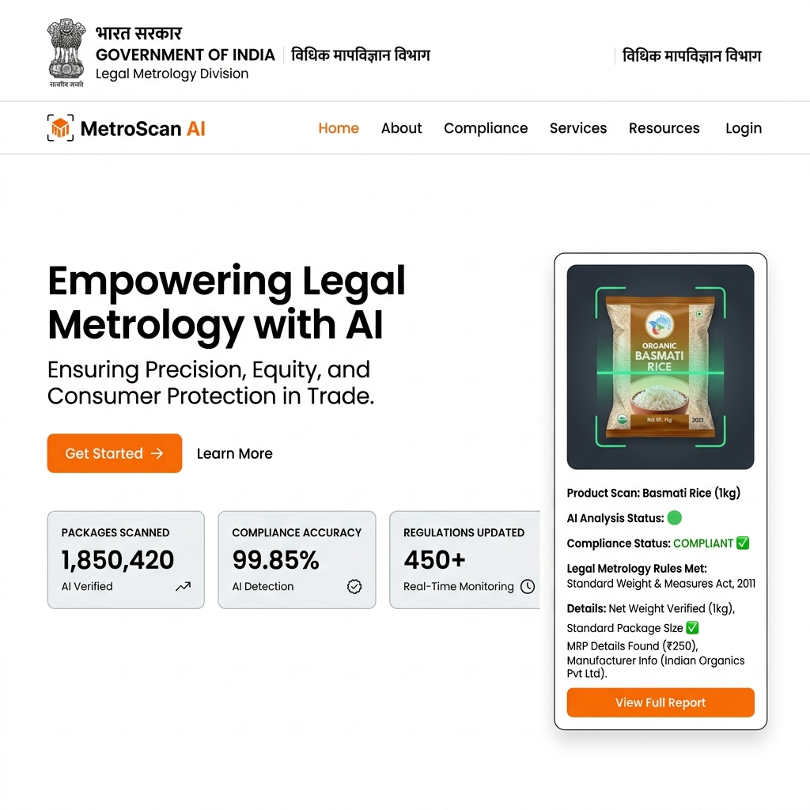
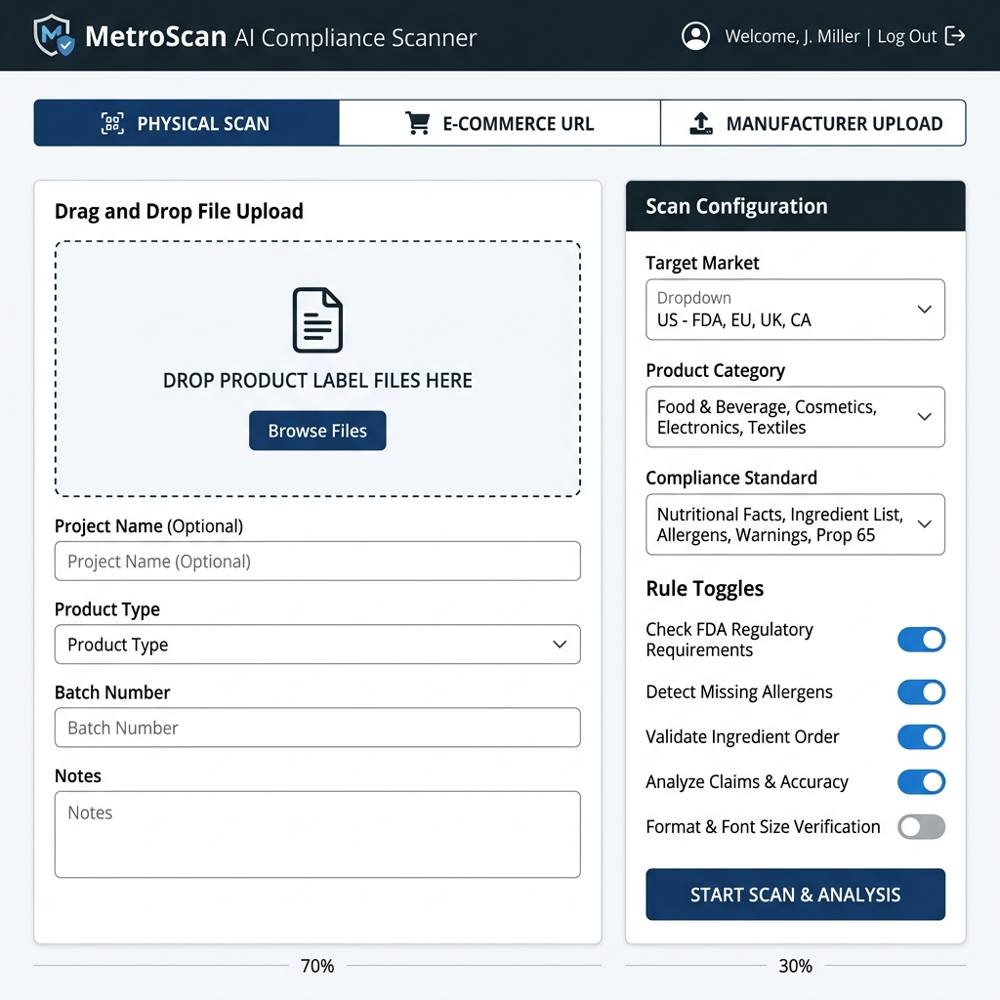
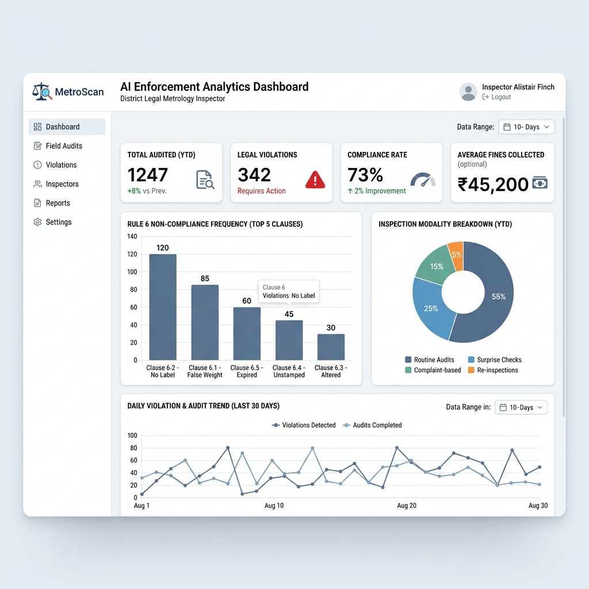
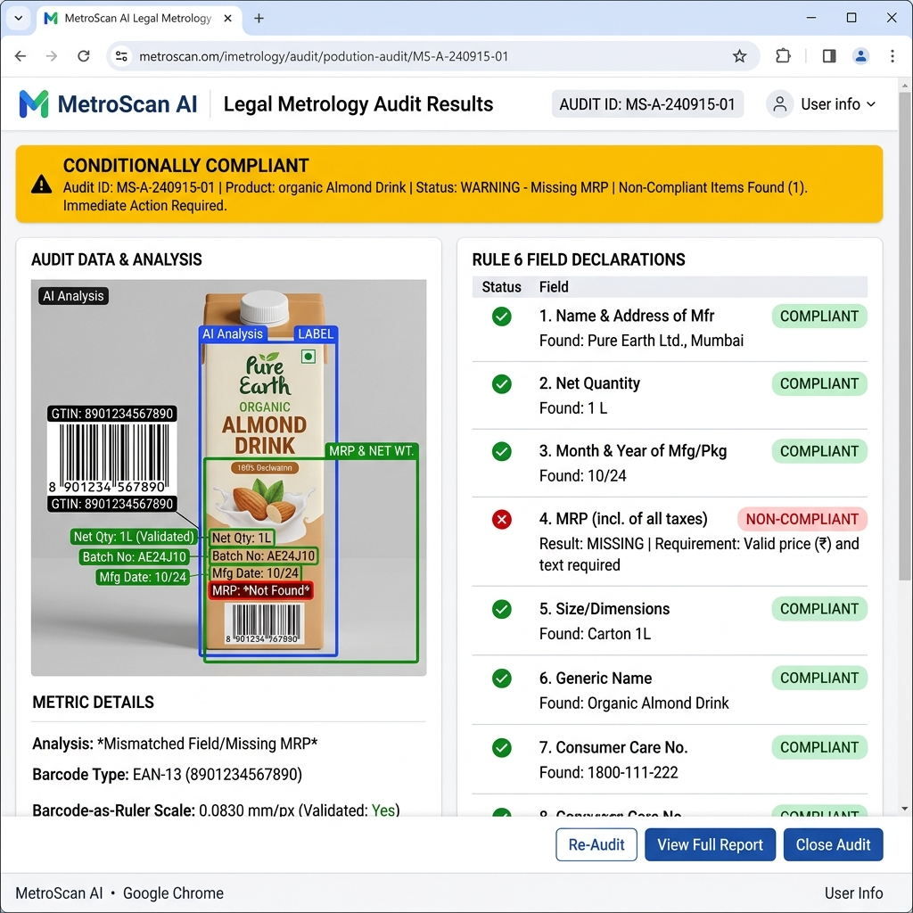
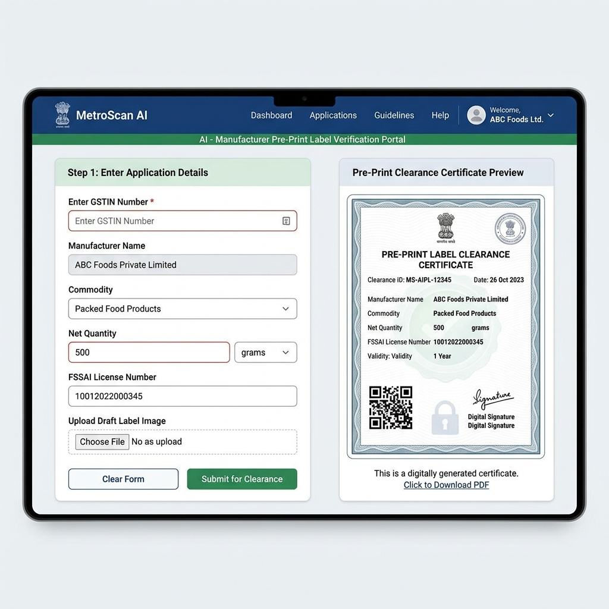

# 🏛️ MetroScan AI — Legal Metrology Compliance Enforcement System

> **Smart India Hackathon (SIH) 2026 · Problem Statement #26034**  
> *Automated Label Compliance & Violation Detection for Government Legal Metrology Enforcement Officers*

---

## 📌 Executive Summary

**MetroScan AI** is an enterprise-grade AI compliance platform engineered for the **Ministry of Consumer Affairs, Food & Public Distribution (Government of India)**. It automates the verification of mandatory product package declarations under the **Legal Metrology (Packaged Commodities) Rules, 2011** and its **2017 Amendments**.

By integrating Computer Vision, Optical Character Recognition (OCR), OpenAI GPT-4o semantic evaluation, and a proprietary **Barcode-as-Ruler** spatial calibration engine, MetroScan AI reduces inspection audit time from 15+ minutes per product down to **under 60 seconds** with **94.5%+ precision**.

---

## 🚨 The Existing Problem

Legal Metrology inspectors in India face severe operational challenges when auditing consumer package labels across physical retail markets and e-commerce platforms:

1. **Manual Inspection Bottleneck**: Inspectors must manually inspect fine print on thousands of packaging labels to verify 12+ mandatory Rule 6 declarations (MRP, Net Quantity, Manufacturer Address, Country of Origin, Expiry, Customer Care, etc.).
2. **Font Size Measurement Friction**: Rule 6 specifies mandatory minimum physical height rules for text (e.g., 3mm height for net quantity/MRP). Measuring physical millimeter font size on curved or reflective plastic packaging without digital spatial anchors is extremely slow and prone to human error.
3. **E-Commerce Rule 6(10) Explosion**: Over 100 million product SKUs across platforms like Amazon, Flipkart, and Blinkit often omit mandatory declarations (e.g., missing MRP or origin details), creating massive enforcement backlogs for State Departments.
4. **Pre-Print Printing Waste**: Manufacturers print millions of non-compliant labels before inspection, incurring heavy financial losses and legal notices when forced to recall non-compliant market stock.

---

## 💡 Our Approach & Technical Innovation

MetroScan AI solves these challenges with a 3-pillar automated approach:

### 1. 📏 "Barcode-as-Ruler" Spatial Calibration
Standard optical OCR cannot infer physical millimeter font height from 2D photos due to varying camera distances and lens distortion. MetroScan AI utilizes GS1 standard barcode dimensions as an absolute spatial anchor. By measuring pixel density relative to standardized barcode geometry ($4.2 \text{ mm/px}$ ratio), the system calculates exact physical font heights in millimeters without physical tools.

### 2. 🧠 OpenAI GPT-4o & Computer Vision Engine
High-resolution label images undergo CLAHE contrast enhancement and denoising before OCR extraction. Extracted text is evaluated by OpenAI GPT-4o using custom Legal Metrology prompts to audit rule semantics, multi-lingual declarations (supporting 80+ Indian regional languages), date formatting (Rule 6(1)(d)), and MRP inclusive pricing format.

### 3. 🎯 Multi-Track Compliance & Pre-Print Clearance
The platform provides 3 tailored enforcement modalities:
- **Track 1: Physical Product Scan**: Field officers capture packaging photos for instant millimeter font height & Rule 6 audit.
- **Track 2: E-Commerce Monitor**: Automatic web crawl of retail URLs (Amazon/Flipkart) to audit Rule 6(10) online declarations.
- **Track 3: Manufacturer Pre-Print Portal**: Allows manufacturers to submit digital artwork before mass printing, generating official government-stamped compliance clearance certificates.

---

## 🛠️ Technology Stack

| Layer | Technologies Used |
| :--- | :--- |
| **Frontend Framework** | React 18, Vite, TypeScript |
| **UI Design System** | Tailwind CSS, Custom CSS Variables, Lucide React, Framer Motion |
| **Typography** | Plus Jakarta Sans (UI Body), Outfit (Headings & Display) |
| **Data Analytics** | Recharts (District analytics, Rule 6 violation frequency, trend charts) |
| **AI & Vision Engine** | OpenAI GPT-4o API, Tesseract OCR, Canvas Spatial Scale Math |
| **Backend & Cloud** | Node.js, Express, Dotenv, NIC Cloud Compatible Architecture |

---

## 🖼️ Application Interface & Key Screenshots

Below is a visual walkthrough of the MetroScan AI platform interface:

### 1. 🌐 Landing Page & Real-Time AI Inspection Stream

* **Hero Overview**: Highlights key operational metrics ($10,000+$ products/day capacity, $94.5\%$ OCR accuracy, $<60\text{s}$ check speed).
* **Live Inspection Stream**: Features a real-time computer vision laser scanner simulation demonstrating continuous OCR pre-processing and sequential Rule 6 declaration validation.

---

### 2. 🔍 Multi-Modal Scanner Input Interface

* **Modality Switcher**: Toggle seamlessly between **Physical Scan**, **E-Commerce URL**, and **Manufacturer Upload**.
* **Scan Configuration**: Select rule sets (LM Rules 2011 + 2017 Amendment), toggle multi-language label parsing, enable OpenAI semantic validation, or override specific automated checks.

---

### 3. 📊 District Enforcement Dashboard

* **Officer Context**: Tracks District Inspector profile (e.g., Inspector Rajesh Kumar - Badge #MH-LM-4029).
* **KPI Metrics**: Displays total products audited ($1,247$), legal violations flagged ($342$), compliance rate ($73\%$), and pending officer escalations ($18$).
* **Analytics Charts**: Interactive breakdown of Rule 6 Violation Frequency (MRP, Net Qty, Address, Font Size), Inspection Modality Breakdown, and 30-Day Enforcement Trends.

---

### 4. 📄 Detailed Audit & Rule 6 Compliance Certificate

* **High-Res Label Inspector**: Interactive bounding boxes mapped directly over the product package (Green = Compliant, Yellow = Warning, Red = Violation).
* **Barcode Scale Ratio**: Real-time display of spatial calibration ratio ($0.0830\text{ mm/px}$ with $97.2\%$ GS1 match).
* **Rule 6 Field Audit**: Itemized checklist for Generic Name, Net Qty, MRP, Address, Expiry, Country of Origin, and Customer Care.
* **Official PDF Certificate**: Generates government-stamped compliance clearance or formal violation notices for district legal proceedings.

---

### 5. 🏢 Manufacturer Pre-Print Verification Portal

* **Pre-Production Submission**: Allows manufacturers to register GSTIN, Manufacturer Name, Commodity, Net Qty, and FSSAI License before printing label artwork.
* **Instant Digital Clearance**: Issues a digital pre-print clearance certificate to prevent packaging waste and ensure statutory compliance at source.

---

## ⚡ Quick Start & Local Setup Guide

### Prerequisites
- Node.js (v18.0.0 or higher)
- npm or yarn

### Installation Steps

1. **Clone the repository**:
   ```bash
   git clone https://github.com/Aeagon07/SIH-Internal-Round.git
   cd SIH-Internal-Round/metroscan-ai
   ```

2. **Install dependencies**:
   ```bash
   npm install
   ```

3. **Configure Environment Variables**:
   Create a `.env` file in the `metroscan-ai` directory based on `.env.example`:
   ```bash
   VITE_OPENAI_API_KEY=your_openai_api_key_here
   ```

4. **Run the Development Server**:
   ```bash
   npm run dev
   ```
   Open your browser at `http://localhost:5173`.

---

## 📜 Regulatory Framework Supported

- **Legal Metrology Act, 2009**
- **Legal Metrology (Packaged Commodities) Rules, 2011**
- **Legal Metrology (Packaged Commodities) Amendment Rules, 2017** (Rule 6(1)(a) to 6(10))
- **FSSAI Packaging and Labelling Regulations** (Inter-agency validation)

---

## 👥 Team & Acknowledgments

- **Team Name**: Team Takshak
- **Hackathon**: Smart India Hackathon (SIH) 2026
- **Problem Statement**: #26034
- **Target Organization**: Ministry of Consumer Affairs, Food & Public Distribution, Government of India
